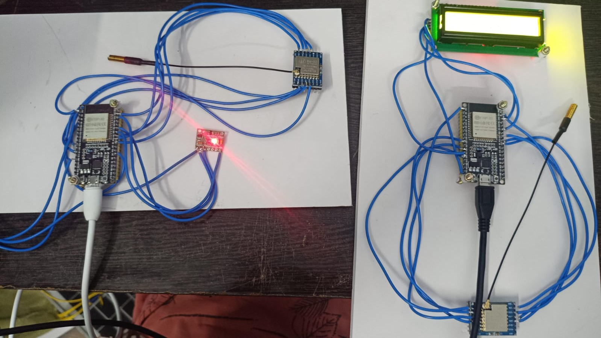
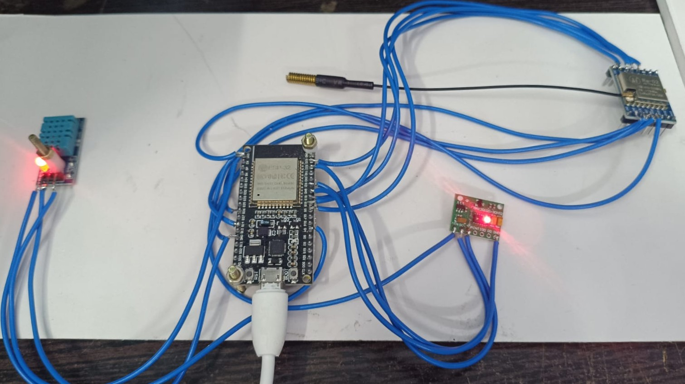
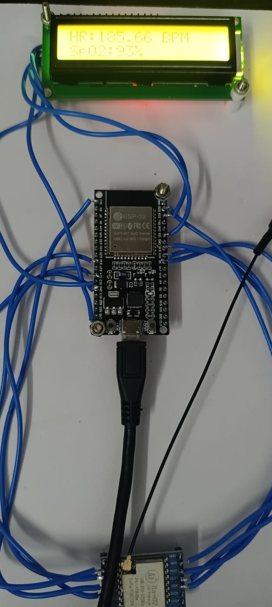

# ESP32 LoRa Health & Environment Monitoring System


A point-to-point wireless monitoring system built on two ESP32 boards and SX1278 LoRa modules (433 MHz). The **transmitter node** measures heart rate, SpO2, temperature and humidity, and sends them over LoRa. The **receiver node** decodes the packet and shows the readings on a 16x2 I2C LCD.

---

## Table of Contents

* [Project Overview](#project-overview)
* [Key Features](#key-features)
* [System Architecture](#system-architecture)
* [Hardware Required](#hardware-required)
* [Pin Connections](#pin-connections)
* [LoRa Configuration](#lora-configuration)
* [Data Packet Format](#data-packet-format)
* [Software Requirements](#software-requirements)
* [How It Works](#how-it-works)
* [Sample Output](#sample-output)
* [Project Gallery](#project-gallery)
* [Demonstration Video](#demonstration-video)
* [Troubleshooting](#troubleshooting)
* [Known Limitations](#known-limitations)
* [Future Improvements](#future-improvements)
* [Repository Structure](#repository-structure)
* [Disclaimer](#disclaimer)

---

## Project Overview

This project demonstrates long-range, low-power sensor data transmission using LoRa.

| Node | Role | Main Components |
| ---- | ---- | --------------- |
| **ESP1** | Transmitter | ESP32, MAX30100 pulse oximeter, DHT11, SX1278 |
| **ESP2** | Receiver | ESP32, SX1278, 16x2 I2C LCD |

ESP1 samples the sensors continuously and transmits one packet every 2 seconds. ESP2 listens in continuous receive mode, parses the packet, and cycles the LCD between two screens: heart rate / SpO2 and temperature / humidity.

The two nodes use different LoRa software approaches on purpose:

* **ESP1** uses the `LoRa.h` library.
* **ESP2** drives the SX1278 directly through **SPI register-level code**, with no LoRa library. This shows how the chip is configured internally (frequency, bandwidth, spreading factor, FIFO handling and IRQ flags).

## Key Features

* Point-to-point LoRa link at **433 MHz**
* Real-time heart rate and SpO2 measurement (MAX30100)
* Temperature and humidity measurement (DHT11)
* Transmitter based on the `LoRa.h` library
* Receiver based on **direct SX1278 register access over SPI**
* CRC-protected packets (corrupted packets are rejected)
* SX1278 chip detection at startup via the version register (`0x12`)
* Two-screen 16x2 I2C LCD display
* Serial monitor logging on both nodes

## System Architecture

```
        ESP1 - TRANSMITTER                                   ESP2 - RECEIVER
┌──────────────────────────────┐                    ┌──────────────────────────────┐
│  MAX30100  (HR, SpO2) -- I2C │                    │                              │
│  DHT11     (Temp, Hum)        │                    │  SX1278 (RX continuous mode) │
│            |                  │                    │            |                 │
│          ESP32                │                    │          ESP32               │
│            | SPI              │   433 MHz LoRa     │            | I2C             │
│        SX1278 TX  ))))))))))))))))))))))))))))))))))) SX1278    |                 │
└──────────────────────────────┘                    │       16x2 I2C LCD           │
                                                    └──────────────────────────────┘
```

**Data flow**

```
Sensors -> ESP32 (ESP1) -> SX1278 -> LoRa 433 MHz -> SX1278 -> ESP32 (ESP2) -> Parse packet -> LCD + Serial Monitor
```

## Hardware Required

### Transmitter (ESP1)

| Component | Quantity |
| --------- | -------- |
| ESP32 development board | 1 |
| SX1278 LoRa module (433 MHz) | 1 |
| MAX30100 pulse oximeter and heart rate sensor | 1 |
| DHT11 temperature and humidity sensor | 1 |
| 433 MHz antenna | 1 |
| Breadboard and jumper wires | As required |

### Receiver (ESP2)

| Component | Quantity |
| --------- | -------- |
| ESP32 development board | 1 |
| SX1278 LoRa module (433 MHz) | 1 |
| 16x2 LCD with I2C backpack (address `0x27`) | 1 |
| 433 MHz antenna | 1 |
| Breadboard and jumper wires | As required |

> **Important:** always connect the antenna before powering the SX1278. Transmitting without an antenna can damage the module.

## Pin Connections

### SX1278 to ESP32 (same on both nodes)

| SX1278 Pin | ESP32 Pin |
| ---------- | --------- |
| SCK | GPIO 18 |
| MISO | GPIO 19 |
| MOSI | GPIO 23 |
| NSS (CS) | GPIO 5 |
| RST | GPIO 14 |
| DIO0 | GPIO 26 |
| VCC | 3.3 V |
| GND | GND |

### ESP1 sensors

| Device | Pin | ESP32 Pin |
| ------ | --- | --------- |
| MAX30100 | SDA | GPIO 21 |
| MAX30100 | SCL | GPIO 22 |
| DHT11 | DATA | GPIO 4 |

### ESP2 LCD

| LCD (I2C) Pin | ESP32 Pin |
| ------------- | --------- |
| SDA | GPIO 21 |
| SCL | GPIO 22 |

> Power and ground connections depend on your modules. Check each module's rated voltage before wiring.

## LoRa Configuration

Both nodes must use identical radio settings.

| Parameter | Value |
| --------- | ----- |
| Frequency | 433 MHz |
| Bandwidth | 125 kHz |
| Spreading Factor | SF7 |
| Coding Rate | 4/5 |
| Header Mode | Explicit |
| CRC | Enabled (receiver) |
| Sync Word | `0x12` (default) |

The receiver sets these values directly in the SX1278 registers:

| Register | Value | Purpose |
| -------- | ----- | ------- |
| `REG_FRF_MSB/MID/LSB` | `0x6C 0x40 0x00` | 433 MHz carrier |
| `REG_MODEM_CONFIG1` | `0x72` | BW 125 kHz, CR 4/5, explicit header |
| `REG_MODEM_CONFIG2` | `0x74` | SF7, CRC enabled |
| `REG_MODEM_CONFIG3` | `0x04` | AGC auto on |

## Data Packet Format

ESP1 sends a single ASCII string:

```
HR:<heart rate>,SPO2:<oxygen %>,TEMP:<temperature C>,HUM:<humidity %>
```

Example:

```
HR:78.00,SPO2:98,TEMP:29.0,HUM:62.0
```

ESP2 searches for each key (`HR:`, `SPO2:`, `TEMP:`, `HUM:`) in the packet and extracts the value that follows it. Any field it cannot find is shown as `NA`.

## Software Requirements

The code is written in C++ using the Arduino framework for ESP32.

| Library | Used In |
| ------- | ------- |
| `LoRa` | ESP1 |
| `MAX30100_PulseOximeter` | ESP1 |
| `DHT sensor library` | ESP1 |
| `Adafruit Unified Sensor` | ESP1 |
| `LiquidCrystal_I2C` | ESP2 |
| `Wire`, `SPI` | Both |

Serial monitor baud rate on both nodes: **115200**.

## How It Works

1. ESP1 initialises the MAX30100 and the LoRa module, then keeps updating the pulse oximeter continuously.
2. Every 2 seconds, ESP1 reads heart rate, SpO2, temperature and humidity, builds the data string and transmits it.
3. ESP2 resets the SX1278, configures it through SPI registers, checks the chip version (`0x12`), and enters continuous receive mode.
4. When a packet arrives, ESP2 checks the CRC, reads the payload from the FIFO, parses the four values and shows them on the LCD.

Place a finger gently on the MAX30100 and hold it still. Heart rate and SpO2 take a few seconds to stabilise.

## Sample Output

> Values below are examples of the output format.

### Transmitter serial monitor (ESP1)

```
Initializing MAX30100...
MAX30100 READY
LoRa READY
Heart Rate: 78.00 BPM
SpO2: 98 %
Temperature: 29.00 C
Humidity: 62.00 %
LoRa TX: HR:78.00,SPO2:98,TEMP:29.0,HUM:62.0
--------------------
```

### Receiver serial monitor (ESP2)

```
==========================================
 ESP2 - LoRa RECEIVER
==========================================
SPI started.
SX1278 Version = 0x12
SX1278 detected successfully.
ESP2 RECEIVER READY

========== LoRa RX ==========
Received: HR:78.00,SPO2:98,TEMP:29.0,HUM:62.0
=============================
```

### Receiver LCD

```
Screen 1               Screen 2
┌────────────────┐     ┌────────────────┐
│HR:78.00 BPM    │     │Temp:29.0 C     │
│SpO2:98%        │     │Hum:62.0 %      │
└────────────────┘     └────────────────┘
```

## Project Gallery

### Complete setup



### Transmitter side (ESP1)



### Receiver side (ESP2)



## Demonstration Video

[Watch the complete LoRa health monitoring demonstration](https://drive.google.com/file/d/18sdLzKT1olVpTFj2FlPXamT_PBP3BQbn/view?usp=drivesdk)

## Troubleshooting

| Problem | Possible Cause and Fix |
| ------- | ---------------------- |
| `SX1278 not detected` / `Check wiring` on LCD | Check SPI wiring (SCK, MISO, MOSI, NSS), power and common ground. The version register must read `0x12`. |
| `MAX30100 FAILED!` | Check SDA/SCL wiring and power. Confirm the module is a MAX30100. |
| Receiver shows `Waiting Data...` | Confirm both nodes use the same frequency and modem settings, and that both antennas are attached. |
| `CRC ERROR!` on receiver | Weak signal or interference. Move the nodes closer and check antennas and power supply. |
| Heart rate and SpO2 are `0` | No finger detected. Place a finger lightly on the sensor and keep it still. |
| Temperature or humidity shows `nan` | DHT11 data wire not connected or wrong pin. |
| Random resets or unstable readings | Use a stable power source. Radio transmission causes current spikes. |

## Known Limitations

* The receiver LCD routine uses blocking `delay()` calls (about 3 seconds per packet), so packets arriving during the display cycle can be missed. Packets are sent every 2 seconds, so some will be skipped.
* The transmitter prints `Transmission: SUCCESS` after every send without checking a result.
* The DHT11 has limited accuracy (about +/-2 C and +/-5 % RH).
* The MAX30100 is sensitive to finger movement and ambient light.
* One-way link only: there is no acknowledgement from the receiver.

## Future Improvements

* Replace blocking delays on the receiver with non-blocking timing (`millis()`)
* Interrupt-driven reception using the DIO0 pin
* Two-way communication with acknowledgements
* RSSI and SNR display on the LCD
* Packet numbering and node identification
* Multiple transmitter nodes
* Upgrade to a more accurate temperature and humidity sensor
* Cloud dashboard or mobile application for remote monitoring
* Alert thresholds for abnormal heart rate or SpO2

## Repository Structure

```
.
├── ESP1_Transmitter/
│   └── ESP1_Transmitter.ino
├── ESP2_Receiver/
│   └── ESP2_Receiver.ino
├── images/
│   ├── full_setup.jpeg
│   ├── transmitter_side.jpeg
│   └── receiver_side.jpeg
└── README.md
```

## Disclaimer

This project is built for learning and demonstration. It is **not a medical device** and must not be used for diagnosis or any medical decision. Pulse oximeter readings from a hobby-grade sensor are not clinically accurate.
